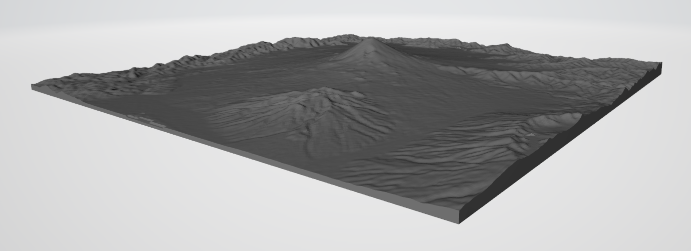

# topo
Automatically generate STLs for terrain

## How to use it
`./map2stl.py <upper left lat> <upper left lon> <lower right lat> <lower right lon> <zoom> output/<filename> [--floor <floor>]`

- First 4 arguments are two corners of a rectangle, specified in degrees of latitude and longitude
- Zoom is the zoom level, where each increase in zoom by 1 is twice the spatial resolution
- Floor is an optional argument that specifies what elevation the bottom of the model will be
  - If positive, taken as an absolute value in meters
  - If negative, taken as an offset from the lowest elevation in the data, also in meters
  
## How it works
### Gathering elevation data
Given the specified range to collect data, the tool first downloads a series of PNG files from a
Terrain Tile endpoint server. If these files already exist on disk, it will use those instead of
redownloading. The PNG files encode raw elevation data in meters with the R, G, and B values.
The PNG files are converted into 2D arrays of elevation data and pieced together to encompass the
entire desired range of the map. This array is trimmed to be only the area within the requested
range.

### Reprojecting
The lat, lon, alt data is converted to x, y, z by assuming the Earth is a sphere and projecting
from spherical coordinates to cartesian. This new point cloud of data is rotated to be facing
"up" for STL creation.

### Converting to STL
STL files are simply binary formats storing big lists of triangles. The point cloud data is converted
to these triangles by:

#### Top surface
This gridded data is naiively converted to triangles by drawing a diagonal line between the bottom
left and the top right corner of each "square" in the data.

#### Bottom surface
The bottom surface is the same x/y data as the top surface, but the z value is set to the earlier
specified "floor" value.

#### Edges
Along the perimeter of the rectangle, triangles are generated between the top surface and the bottom
surface.

## Example use
`./map2stl.py 35.543388 138.497557 35.131411 139.002497 10 output/fuji.stl --floor -200`  
Output:  

